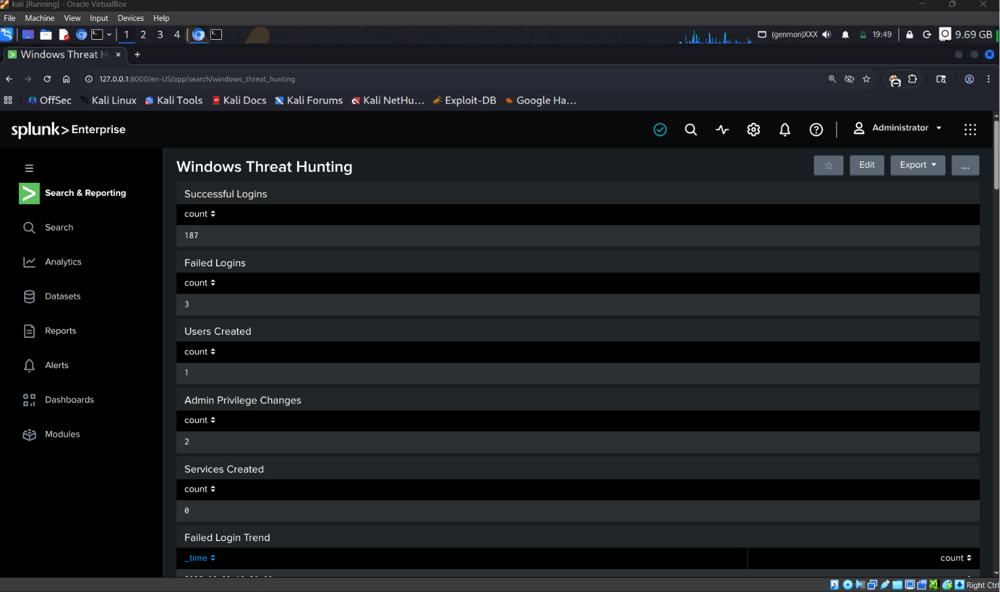

# Windows Threat Hunting Lab using Splunk

## Overview

This project demonstrates threat hunting using Windows Event Logs and Splunk Enterprise.

## Architecture

Windows Machine

↓

Splunk Universal Forwarder

↓

Splunk Enterprise (Kali Linux)

## Threat Scenarios

* Failed Logins (Event ID 4625)
* Successful Logins (Event ID 4624)
* User Creation (Event ID 4720)
* User Deletion (Event ID 4726)
* Administrator Group Changes (Event ID 4732)
* Service Creation (Event ID 7045)

## Dashboard

## Skills Demonstrated

* Threat Hunting
* Splunk Administration
* Windows Event Log Analysis
* Security Monitoring
* Incident Investigation

## MITRE ATT&CK Mapping

| Activity                     | Technique |
| ---------------------------- | --------- |
| Account Discovery            | T1087     |
| System Information Discovery | T1082     |
| Network Service Discovery    | T1046     |
| Valid Accounts               | T1078     |
| Account Manipulation         | T1098     |

## Author

Aravinth S
